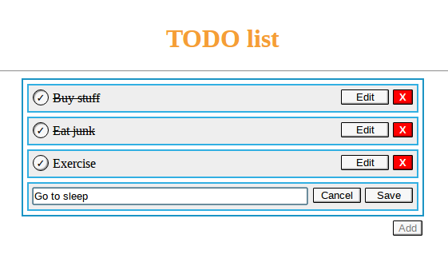

# Angular 2 TODO

My first angular 2 app, made for learning purposes.



It's based on [this yeoman generator](https://github.com/ruffiem/generator-angular2-application-scaffolder),
with some modifications in terms of build system. I added lodash and removed bootstrap (which didn't seem to work).
I didn't bother with tests for now. Data is stored in local storage, so it should persist between sessions.

Despite my best efforts, the project probably has all sorts of anti-patterns,
so you should look into the "official" demo apps if you want to learn angular 2.

## Installation

Presuming you have your typical frontend development environment configured (node, gulp & bower)

```
git clone https://github.com/panta82/angular-2-todo.git
cd andular-2-todo
npm install
bower install
gulp-serve
```

## TODO

TODO for this TODO app

- Tests
- Use actual backend for data
- Use rxjs instead of promises
- Drag & drop
- Error states
- Monetize and retire

## Licence

[WTFPL](http://www.wtfpl.net/about/)